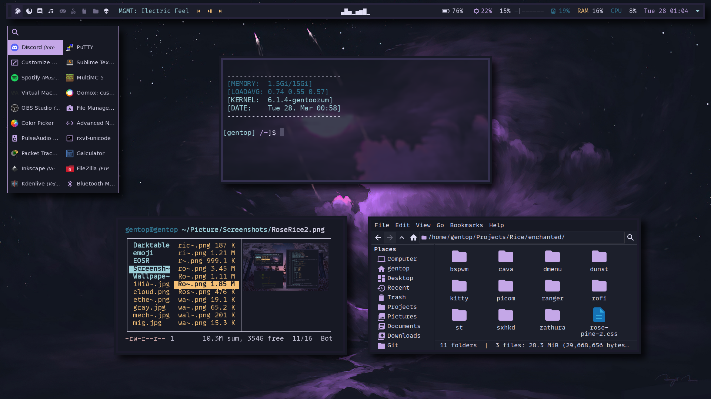

# Enchanted
### Welcome to my dotfiles

**Hey!**   
Well since you're here, feel free to `git clone`

## Install
Clone to desired directory


# Table of contents
- [Overview](#overview)
- [Preview](#preview)
- [Installation](#installation)
- [Keybinds](Keybinds)

# Overview
- Operating System: `Gentoo Linux`
- File mananger: `Ranger/Pcmanfm`
- Launcher: `Rofi` / `Dmenu` 
- Window Manager: `Bspwm`
- Web Browser: `Firefox`
- Music Player: `Spotify`
- Audio Visualizer: `Cava`
- Notifications: `Dunst`
- Image viewer: `Feh`
- Editor: `Neovim`
- Terminal: `St`

# Preview



# Installation

> Make sure to backup your stuff before you continue!

Open a terminal and - 

**1. Clone configs**
```bash
git clone https://github.com/Dembezum/bspwm-enchanted.git
```
**2. cd into bspwm-enchanted**
```bash
cd bspwm-enchanted
```
**3.  copy into directories**
```bash
cp -r bspwm ~/.config
```
```bash
cp -r sxhkd ~/.config
```
**4. make executable**
```bash
chmod +x ~/.config/bspwm/bspwmrc
```
```bash
chmod +x ~/.config/sxhkd/sxhkdrc
```
**5. set wallpaper**
```bash
cp wp.png ~/Pictures/wallpapers && feh --bg-center ~/Pictures/wallpapers/wp.png
```


## Keybindings

```
Here are the basic Keybinds

|    Keybind    |  Application  |      Function     |
| ------------- | ------------- | ----------------- |
| Super + x     | St            | Terminal          |
| Super + k     | Kitty         | Terminal          |
| Super + r     | Rofi          | Run Launcher      |
| Super + e     | Ranger        | Open Filemananger |
| Super + b     | Firefox       | Open Browser      |
| Super + s     | Flameshot     | Screenshot        |
| Super + w     | Bspwm         | Close Window      |
```
> Keybinds are located in `~/.config/sxhkd/sxhkdrc`
